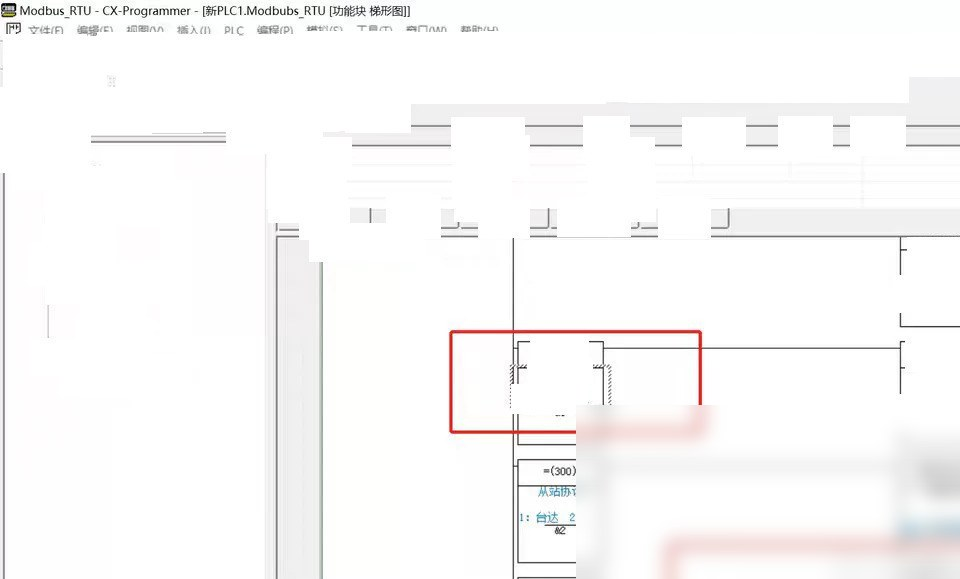
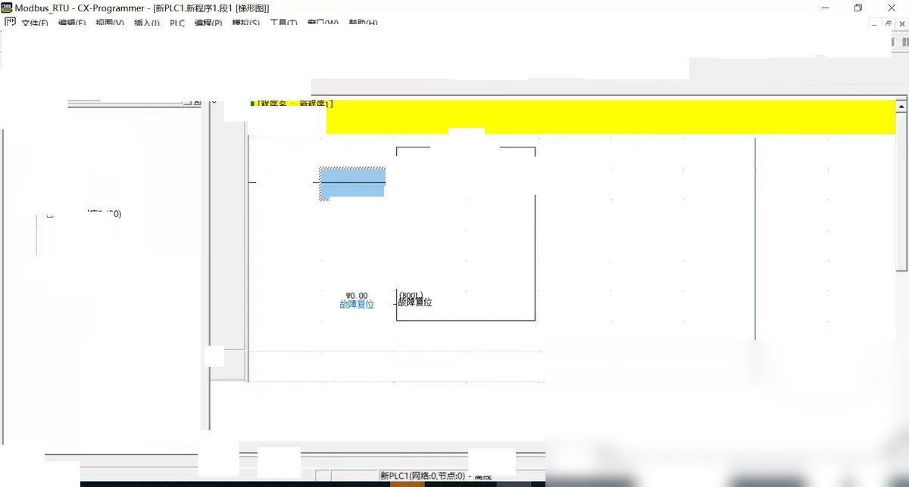
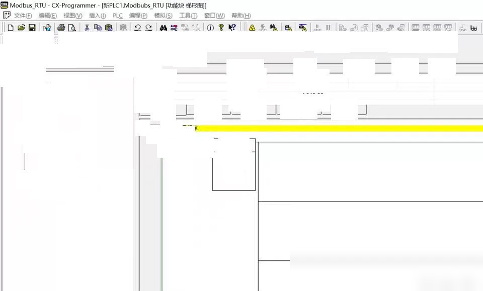

# Here is a simple example of how to write a 485 communication program for the Omron CP1H and Siemens Mitsubishi and Dahua (TP) frequency converters

```c
# include <stdio.h>
# include <stdlib.h>
# include <string.h>
# include <unistd.h>
# include <fcntl.h>
# include <termios.h>

# define BUFFER_SIZE 1024
# define TIMEOUT 5000

int main() {
int fd
char buffer[BUFFER_SIZE
struct termios options
struct timeval timeout

fd = open("/dev/ttyS0", O_RDWR | O_NOCTTY
if (fd == -1) {
perror("Failed to open serial port
exit(1
}

tcgetattr(fd, &options
options.c_cflag |= (CLOCAL | CREAD
options.c_cflag &= ~PARENB
options.c_cflag &= ~CSTOPB
options.c_cflag &= ~CSIZE
options.c_cflag |= CS8
options.c_cflag |= CLOCAL
options.c_cflag &= ~CRTSCTS
options.c_cflag &= ~CREAD
options.c_cflag |= CREAD
options.c_cflag &= ~PARENB
options.c_cflag &= ~CSTOPB
options.c_cflag &= ~CSIZE
options.c_cflag |= CS8
options.c_cflag |= CLOCAL
options.c_cflag &= ~CRTSCTS
options.c_cflag &= ~CREAD
options.c_cflag |= CREAD
options.c_cflag &= ~PARENB
options.c_cflag &= ~CSTOPB
options.c_cflag &= ~CSIZE
options.c_cflag |= CS8
options.c_cflag |= CLOCAL
options.c_cflag &= ~CRTSCTS
options.c_cflag &= ~CREAD
options.c_cflag |= CREAD
options.c_cflag &= ~PARENB
options.c_cflag &= ~CSTOPB
options.c_cflag &= ~CSIZE
options.c_cflag |= CS8
options.c_cflag |= CLOCAL
options.c_cflag &= ~CRTSCTS
options.c_cflag &= ~CREAD
options.c_cflag |= CREAD
options.c_cflag &= ~PARENB
options.c_cflag &= ~CSTOPB
options.c_cflag &= ~CSIZE
options.c_cflag |= CS8
options.c_cflag |= CLOCAL
options.c_cflag &= ~CRTSCTS
options.c_cflag &= ~CREAD
options.c_cflag |= CREAD
options.c_cflag &= ~PARENB
options.c_cflag &= ~CSTOPB
options.c_cflag &= ~CSIZE
options.c_cflag |= CS8
options.c_cflag |= CLOCAL
options.c_cflag &= ~CRTSCTS
options.c_cflag &= ~CREAD
options.c_cflag |= CREAD
options.c_cflag &= ~PARENB
options.c_cflag &= ~CSTOPB
options.c_cflag &= ~CSIZE
options.c_cflag |= CS8
options.c_cflag |= CLOCAL
options.c_cflag &= ~CRTSCTS
options.c_cflag &= ~CREAD
options.c_cflag |= CREAD
options.c_cflag &= ~PARENB
options.c_cflag &= ~CSTOPB
options.c_cflag &= ~CSIZE
options.c_cflag |= CS8
options.c_cflag |= CLOCAL
options.c_cflag &= ~CRTSCTS
options.c_cflag &= ~CREAD
options.c_cflag |= CREAD
options.c_cflag &= ~PARENB
options.c_cflag &= ~CSTOPB
options.c_cflag &= ~CSIZE
options.c_cflag |= CS8
options.c_cflag |= CLOCAL
options.c_cflag &= ~CRTSCTS
options.c_cflag &= ~CREAD
options.c_cflag |= CREAD
options.c_cflag &= ~PARENB
options.c_cflag &= ~CSTOPB
options.c_cflag &= ~CSIZE
options.c_cflag |= CS8
options.c_cflag |= CLOCAL
options.c_cflag &= ~CRTSCTS
options.c_cflag &= ~CREAD
options.c_cflag |= CREAD
options.c

# Body

Here is a simple example of how to write a 485 communication program for the Omron CP1H and Siemens, Mitsubishi, and Dahua (TP) frequency converters

```c
# include <stdio.h>
# include <stdlib.h>
# include <string.h>
# include <unistd.h>
# include <fcntl.h>
# include <termios.h>

# define BUFFER_SIZE 1024
# define TIMEOUT 5000

int main() {
int fd
char buffer[BUFFER_SIZE
struct termios options
struct timeval timeout

fd = open("/dev/ttyS0", O_RDWR | O_NOCTTY
if (fd == -1) {
perror("Failed to open serial port
exit(1
}

tcgetattr(fd, &options
options.c_cflag |= (CLOCAL | CREAD
options.c_cflag &= ~PARENB
options.c_cflag &= ~CSTOPB
options.c_cflag &= ~CSIZE
options.c_cflag |= CS8
options.c_cflag |= CLOCAL
options.c_cflag &= ~CRTSCTS
options.c_cflag &= ~CREAD
options.c_cflag |= CREAD
options.c_cflag &= ~PARENB
options.c_cflag &= ~CSTOPB
options.c_cflag &= ~CSIZE
options.c_cflag |= CS8
options.c_cflag |= CLOCAL
options.c_cflag &= ~CRTSCTS
options.c_cflag &= ~CREAD
options.c_cflag |= CREAD
options.c_cflag &= ~PARENB
options.c_cflag &= ~CSTOPB
options.c_cflag &= ~CSIZE
options.c_cflag |= CS8
options.c_cflag |= CLOCAL
options.c_cflag &= ~CRTSCTS
options.c_cflag &= ~CREAD
options.c_cflag |= CREAD
options.c_cflag &= ~PARENB
options.c_cflag &= ~CSTOPB
options.c_cflag &= ~CSIZE
options.c_cflag |= CS8
options.c_cflag |= CLOCAL
options.c_cflag &= ~CRTSCTS
options.c_cflag &= ~CREAD
options.c_cflag |= CREAD
options.c_cflag &= ~PARENB
options.c_cflag &= ~CSTOPB
options.c_cflag &= ~CSIZE
options.c_cflag |= CS8
options.c_cflag |= CLOCAL
options.c_cflag &= ~CRTSCTS
options.c_cflag &= ~CREAD
options.c_cflag |= CREAD
options.c_cflag &= ~PARENB
options.c_cflag &= ~CSTOPB
options.c_cflag &= ~CSIZE
options.c_cflag |= CS8
options.c_cflag |= CLOCAL
options.c_cflag &= ~CRTSCTS
options.c_cflag &= ~CREAD
options.c_cflag |= CREAD
options.c_cflag &= ~PARENB
options.c_cflag &= ~CSTOPB
options.c_cflag &= ~CSIZE
options.c_cflag |= CS8
options.c_cflag |= CLOCAL
options.c_cflag &= ~CRTSCTS
options.c_cflag &= ~CREAD
options.c_cflag |= CREAD
options.c_cflag &= ~PARENB
options.c_cflag &= ~CSTOPB
options.c_cflag &= ~CSIZE
options.c_cflag |= CS8
options.c_cflag |= CLOCAL
options.c_cflag &= ~CRTSCTS
options.c_cflag &= ~CREAD
options.c_cflag |= CREAD
options.c_cflag &= ~PARENB
options.c_cflag &= ~CSTOPB
options.c_cflag &= ~CSIZE
options.c_cflag |= CS8
options.c_cflag |= CLOCAL
options.c_cflag &= ~CRTSCTS
options.c_cflag &= ~CREAD
options.c_cflag |= CREAD
options.c_cflag &= ~PARENB
options.c_cflag &= ~CSTOPB
options.c_cflag &= ~CSIZE
options.c_cflag |= CS8
options.c_cflag |= CLOCAL
options.c_cflag &= ~CRTSCTS
options.c_cflag &= ~CREAD
options.c_cflag |= CREAD
options.c

# Images





# Payment

Here is a pay link on Stripe ( https://buy.stripe.com/3cs8yP7sY87d0vu9AB ). Please contact me lonlonago@foxmail.com after funding $89, and I will send you a complete data files , thank you


Computer vision/deep learning algorithm services primarily focus on areas such as object detection, image segmentation, multimodal analysis, defect detection, face recognition, OCR, medical image analysis, autonomous driving perception, video understanding, behavior recognition, point cloud processing, image enhancement and restoration, image retrieval, and motion prediction.
Communication can be conducted based on specific tasks: model replication, algorithm optimization, performance improvement, model modification, code interpretation/code analysis, data processing, environment configuration, parameter tuning, experimental design, and result analysis, etc.
Core direction overview:
1. Object detection/tracking
Object detection, salient object detection, keypoint detection, lane line detection, point cloud object detection, point cloud segmentation, object tracking, motion detection, motion prediction.
2. Image segmentation/reconstruction
Image segmentation, semantic segmentation, medical image segmentation, geographic information segmentation, remote sensing data segmentation, 3D reconstruction, super-resolution reconstruction, point matching.
3. Face recognition/OCR/Industrial inspection
Face recognition, face detection, mask detection, license plate recognition, text recognition, OCR, defect detection, industrial inspection, anomaly detection.
4. Video understanding/behavior recognition
Video understanding, behavior recognition, pose estimation, gesture recognition, fight recognition, depth estimation, and autonomous driving perception.
5. Image enhancement/restoration
Image dehazing, image deraining, denoising, defogging, image restoration, and image compression.
6. Multimodal/large model related
The directions of multimodal, large model fine-tuning, algorithm analysis, and joint image-text representation are communicable.
Technology stack:
Inference frameworks: TensorRT, ONNX, OpenVINO
Common models/directions: YOLO, GAN, VIT, SLAM, diffusion models, etc. Discussions can be held based on project requirements.
Application fields:
For applications such as street view, medicine, remote sensing, daily scenes, industrial inspection, autonomous driving, and biomedical imaging, we can first discuss the specific requirements.
Individual work, suitable for developers with experience in computer vision, deep learning, algorithm replication, model optimization, code development, and project requirements.
The price is determined based on the difficulty and workload of the project.
Individual order receiving, quality guaranteed, after-sales service guaranteed. Welcome to directly send a private message to specify the specific task. We can communicate according to the specific task: model replication, algorithm optimization, performance improvement, model modification, code interpretation/code analysis, data processing, environment configuration, parameter tuning, experimental design and result analysis, etc.
Contact information: lonlonago@foxmail.com

